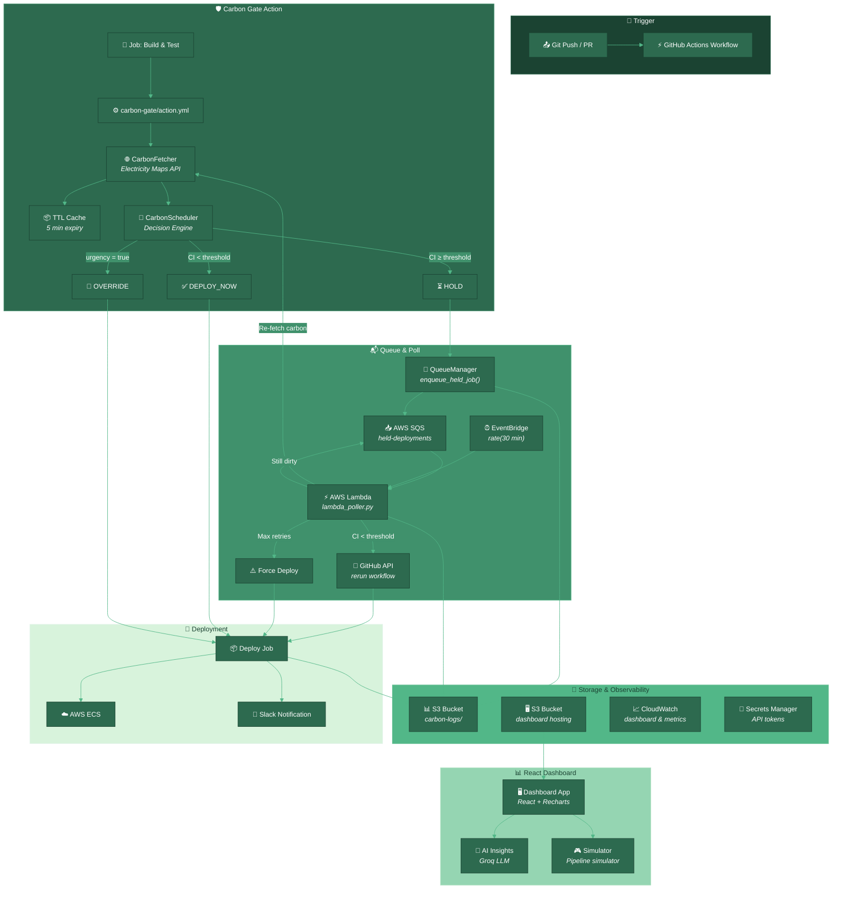

<p align="center">
  
  
  
  
  
  
</p>

<h1 align="center">🌱 GreenGate</h1>
<h3 align="center">Carbon-Aware Deployment Scheduler</h3>

<p align="center">
  <em>A GitHub Actions plugin that intelligently delays non-urgent CI/CD deployments to AWS regions powered by the <strong>cleanest grid energy</strong> — then tracks every kilogram of CO₂ saved on a live dashboard.</em>
</p>

---

## 📋 Table of Contents

- [Overview](#-overview)
- [Architecture](#-architecture)
- [How It Works](#-how-it-works)
- [Carbon Scoring](#-carbon-scoring)
- [Quick Start](#-quick-start)
- [Deployment](#-deployment)
- [Environment Variables](#-environment-variables)
- [Tech Stack](#-tech-stack)
- [AWS Region Mapping](#-aws-region--grid-zone-mapping)
- [Testing](#-testing)
- [Project Structure](#-project-structure)
- [License](#-license)

---

## 🌍 Overview

**GreenGate** tackles the carbon footprint of cloud operations by acting as a smart gate between CI/CD triggers and actual deployments. It queries real-time electrical grid carbon intensity via the [Electricity Maps API](https://www.electricitymaps.com/), scores each deployment request, and either allows, queues, or overrides the deployment based on how green the grid is at that moment.

| Capability | Description |
|---|---|
| **Real-time Carbon Tracking** | Fetches live gCO₂/kWh + renewable/fossil breakdown per AWS region |
| **Smart Gate Validation** | Configurable thresholds decide DEPLOY_NOW, HOLD (auto-retry), or OVERRIDE |
| **Automated Dispatch** | Held jobs queue in SQS; Lambda re-checks every 30 min and auto-releases on green grid |
| **Live Dashboard** | React + Recharts telemetry dashboard with AI-powered optimization insights |
| **Infrastructure as Code** | One-click Terraform deployment for the entire serverless stack |

<div align="center">
  <sub>🏆 Developed for <strong>HackVerse 2026</strong> — Sustainability & Smart Cities domain</sub>
  <br>
  <sub>Aligns with UN Sustainable Development Goals <strong>#7</strong> (Clean Energy), <strong>#9</strong> (Industry & Innovation), <strong>#11</strong> (Sustainable Cities), <strong>#13</strong> (Climate Action)</sub>
</div>

---

## 🏗 Architecture



### Data Flow Summary

```
1️⃣ Git Push → GitHub Actions triggers build job
2️⃣ Carbon Gate fetches live gCO₂/kWh from Electricity Maps API
3️⃣ Decision engine scores the deployment (DEPLOY_NOW / HOLD / OVERRIDE)
4️⃣ Held jobs enqueue to AWS SQS with retry metadata
5️⃣ Lambda poller re-checks every 30 min (up to 48 retries = 24h max hold)
6️⃣ Clean grid → workflow auto-reruns → deployment proceeds
7️⃣ Every decision logged to S3 → visualized on React dashboard
```

---

## ⚙️ How It Works

### The Decision Pipeline

```
                 ┌─────────────────────┐
                 │   Git Push / PR     │
                 │   triggers workflow │
                 └──────────┬──────────┘
                            │
                            ▼
                 ┌─────────────────────┐
                 │  Job: Build & Test  │
                 │  (always runs)      │
                 └──────────┬──────────┘
                            │
                            ▼
                 ┌─────────────────────┐
                 │  Job: Carbon Gate   │
                 │  (needs: build)     │
                 └──────────┬──────────┘
                            │
                            ▼
              ┌──────────────────────────┐
              │  Fetch Carbon Intensity  │
              │  (Electricity Maps API)  │
              └────────────┬─────────────┘
                           │
                           ▼
              ┌──────────────────────────┐
              │    Evaluate Decision     │
              │                          │
              │  urgency=true? ──► OVERRIDE│
              │  rollback? ──────► DEPLOY_NOW│
              │  CI < threshold? ► DEPLOY_NOW│
              │  CI ≥ threshold? ──► HOLD  │
              └────────────┬─────────────┘
                           │
         ┌─────────────────┼─────────────────┐
         ▼                 ▼                 ▼
   ┌──────────┐     ┌──────────┐     ┌──────────┐
   │DEPLOY_NOW│     │  HOLD    │     │OVERRIDE  │
   │  ✅ Go   │     │  ⏳ Wait │     │  🚨 Go   │
   └──────────┘     └──────────┘     └──────────┘
                         │
                         ▼
              ┌──────────────────────┐
              │ Enqueue to SQS       │
              │ (up to 48 retries)   │
              └──────────────────────┘
```

---

## 📊 Carbon Scoring

| gCO₂/kWh | Quality | Decision | Action |
|---|---|---|---|
| **< 150** | 🟢 Very Green | **DEPLOY_NOW** ✅ | Proceed immediately |
| **150 – 250** | 🟡 Acceptable | **DEPLOY_NOW** ✅ | Proceed immediately |
| **250 – 400** | 🟠 Hold Zone | **HOLD** ⏳ | Queue, re-check in 30 min |
| **> 400** | 🔴 High Carbon | **HOLD** ⏳ | Queue, re-check in 30 min |
| **Any (urgency=true)** | — | **OVERRIDE** 🚨 | Bypass carbon check |

### CO₂ Estimation Formula

```
Estimated CO₂ (kg) = Carbon Intensity (gCO₂/kWh) × Energy per Job Type (kWh) / 1000
```

| Job Type | Energy Estimate |
|---|---|
| `deploy` | 0.002 kWh |
| `release` | 0.003 kWh |
| `rollback` | 0.001 kWh |
| `smoke-test` | 0.0005 kWh |

---

## 🚀 Quick Start

### 1. Add Carbon Gate to Any Workflow

```yaml
- name: Carbon gate
  uses: ./.github/actions/carbon-gate
  with:
    aws_region: us-east-1
    carbon_threshold: 250
    urgency: false
    electricity_maps_token: ${{ secrets.ELECTRICITY_MAPS_TOKEN }}
    job_type: deploy
    sqs_queue_url: ${{ vars.SQS_QUEUE_URL }}
    s3_carbon_bucket: ${{ vars.S3_CARBON_BUCKET }}
```

### 2. Deploy AWS Infrastructure

```bash
cd infra/terraform
terraform init
terraform apply
```

### 3. Run Dashboard Locally

```bash
cd src/dashboard
npm install
npm start
```

### 4. Run Tests

```bash
pip install -r requirements.txt
pytest tests/ -v --cov=src
```

### 5. Quick Demo

```bash
python scripts/run_live_demo.py
```

---

## 🚢 Deployment

See the full [Deployment Guide](DEPLOYMENT_GUIDE.md) for detailed instructions including:

- Step-by-step implementation checklist
- AWS IAM role and policy configuration
- Secrets Manager setup for API tokens
- Verification and smoke tests
- Monitoring and health check metrics
- Rollback procedures
- Team training and support escalation

---

## 🔧 Environment Variables

| Variable | Description | Required | Default |
|---|---|---|---|
| `ELECTRICITY_MAPS_TOKEN` | API token from electricitymaps.com | ✅ Yes | — |
| `AWS_REGION` | Target deployment AWS region | ✅ Yes | — |
| `CARBON_THRESHOLD` | gCO₂/kWh above which deploys are held | ❌ No | `250` |
| `CARBON_GREEN_THRESHOLD` | gCO₂/kWh below which grid is "very green" | ❌ No | `150` |
| `URGENCY_OVERRIDE` | `true` to bypass carbon check entirely | ❌ No | `false` |
| `SQS_QUEUE_URL` | SQS queue URL for held deployment jobs | ⚠️ Conditional | — |
| `S3_CARBON_BUCKET` | S3 bucket for deployment carbon logs | ⚠️ Conditional | — |
| `GITHUB_TOKEN` | GitHub token for workflow re-triggering | ❌ No | Auto-set in Actions |
| `ELECTRICITY_MAPS_TIMEOUT` | API request timeout in seconds | ❌ No | `10` |
| `ELECTRICITY_MAPS_RETRIES` | Max API retry attempts | ❌ No | `3` |
| `CARBON_CACHE_TTL` | Cache TTL in seconds | ❌ No | `300` |
| `ENABLE_CARBON_CACHE` | Enable in-memory caching | ❌ No | `true` |
| `LOG_LEVEL` | Logging verbosity | ❌ No | `INFO` |

---

## 🛠 Tech Stack

| Layer | Technology | Purpose |
|---|---|---|
| **CI/CD Hook** | [GitHub Actions](https://github.com/features/actions) Composite Action | Carbon gate integration |
| **Carbon Data** | [Electricity Maps API](https://www.electricitymaps.com/) v3 | Real-time grid intensity |
| **Decision Engine** | Python 3.11 | Scheduler with configurable thresholds |
| **Message Queue** | AWS SQS | Held deployment buffer |
| **Serverless Poller** | AWS Lambda (Python 3.11) | Auto-retry every 30 min |
| **Event Trigger** | Amazon EventBridge | Lambda schedule: `rate(30 min)` |
| **Data Storage** | AWS S3 (versioned) | Carbon logs + dashboard hosting |
| **Secrets** | AWS Secrets Manager | API token storage |
| **Dashboard** | React 18 + Recharts | Carbon telemetry visualization |
| **AI Insights** | Groq Cloud (Llama 3 / Mixtral) | Carbon audit & optimization reports |
| **Infrastructure** | Terraform (AWS ~>5.0) | One-click stack deployment |
| **Testing** | pytest + moto | Unit & integration tests |
| **Container** | Docker (Alpine) | Build step in workflows |

---

## 🌐 AWS Region → Grid Zone Mapping

| AWS Region | Electricity Maps Zone | Grid | Notes |
|---|---|---|---|
| `us-east-1` | `US-MIDA-PJM` | PJM Interconnection | Virginia |
| `us-east-2` | `US-MIDW-MISO` | MISO | Ohio |
| `us-west-1` | `US-CA-NEVP` | NEVP | California |
| `us-west-2` | `US-NW-PACW` | Pacific West | Oregon |
| `eu-west-1` | `IE` | Irish Grid | Ireland |
| `eu-west-2` | `GB` | UK Grid | London |
| `eu-central-1` | `DE` | German Grid | Frankfurt |
| `eu-north-1` | `SE` | Swedish Grid | Stockholm |
| `ap-southeast-1` | `SG` | Singapore Grid | Singapore |
| `ap-southeast-2` | `AU-NSW` | New South Wales | Sydney |
| `ap-northeast-1` | `JP-KN` | Kansai | Tokyo |
| `ap-south-1` | `IN-SO` | Southern India | Mumbai |
| `sa-east-1` | `BR-CS` | Brazilian Grid | São Paulo |
| `ca-central-1` | `CA-ON` | Ontario | Montreal |

---

## ✅ Testing

```bash
# Install test dependencies
pip install -r requirements.txt

# Run all tests with coverage
pytest tests/ -v --cov=src

# Run specific test modules
pytest tests/test_fetcher.py -v
pytest tests/test_scheduler.py -v
```

### Test Coverage

| Module | Tests |
|---|---|
| **Carbon Fetcher** (`test_fetcher.py`) | Region mapping validation, API response parsing, mock data generation, error handling, cache behavior |
| **Decision Engine** (`test_scheduler.py`) | DEPLOY_NOW at various intensities, HOLD thresholds, OVERRIDE bypass, rollback safety, CO₂ estimation, JSON output format |

---

## 📁 Project Structure

```
carbon-aware-scheduler/
├── .github/
│   ├── actions/
│   │   └── carbon-gate/
│   │       └── action.yml              # 🔌 Composite GitHub Action
│   └── workflows/
│       └── deploy.yml                  # 📋 Example CI/CD pipeline
├── src/
│   ├── config.py                       # ⚙️ Centralized configuration
│   ├── cache.py                        # 💾 TTL-based in-memory cache
│   ├── logging_config.py               # 📝 Structured logging setup
│   ├── fetcher/
│   │   └── carbon_fetcher.py           # 🌐 Electricity Maps API client
│   ├── scheduler/
│   │   └── scheduler.py                # 🧠 Decision engine (core logic)
│   ├── deploy_queue/
│   │   ├── queue_manager.py            # 📨 SQS enqueue + S3 logging
│   │   └── lambda_poller.py            # ⚡ Lambda re-check handler
│   └── dashboard/                      # 📊 React + Recharts dashboard
│       ├── public/
│       └── src/
├── infra/
│   └── terraform/
│       └── main.tf                     # 🏗️ AWS infrastructure (SQS, Lambda, S3, IAM)
├── tests/
│   ├── conftest.py                     # 🧪 Pytest configuration
│   ├── test_fetcher.py                 # Fetcher unit tests
│   └── test_scheduler.py               # Scheduler unit tests
├── scripts/
│   ├── setup.sh                        # 🔧 One-shot environment setup
│   └── run_live_demo.py                # 🎮 Multi-region demo script
├── requirements.txt                    # 📦 Python dependencies
├── Dockerfile                          # 🐳 Build step container
├── example_usage.py                    # 📖 Usage examples
├── DEPLOYMENT_GUIDE.md                 # 📘 Deployment checklist & guide
└── README.md                           # 📄 This file
```

---

## 📄 License

```
MIT License

Copyright (c) 2026 Jacksonfio

Permission is hereby granted, free of charge, to any person obtaining a copy
of this software and associated documentation files (the "Software"), to deal
in the Software without restriction, including without limitation the rights
to use, copy, modify, merge, publish, distribute, sublicense, and/or sell
copies of the Software, and to permit persons to whom the Software is
furnished to do so, subject to the following conditions:

The above copyright notice and this permission notice shall be included in all
copies or substantial portions of the Software.

THE SOFTWARE IS PROVIDED "AS IS", WITHOUT WARRANTY OF ANY KIND, EXPRESS OR
IMPLIED, INCLUDING BUT NOT LIMITED TO THE WARRANTIES OF MERCHANTABILITY,
FITNESS FOR A PARTICULAR PURPOSE AND NONINFRINGEMENT. IN NO EVENT SHALL THE
AUTHORS OR COPYRIGHT HOLDERS BE LIABLE FOR ANY CLAIM, DAMAGES OR OTHER
LIABILITY, WHETHER IN AN ACTION OF CONTRACT, TORT OR OTHERWISE, ARISING FROM,
OUT OF OR IN CONNECTION WITH THE SOFTWARE OR THE USE OR OTHER DEALINGS IN THE
SOFTWARE.
```

---

<p align="center">
  <strong>🌱 Deploy Greener. Compute Cleaner. 🌍</strong>
</p>
